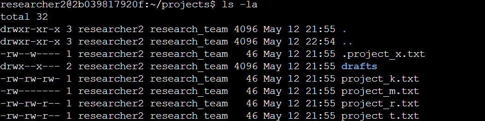
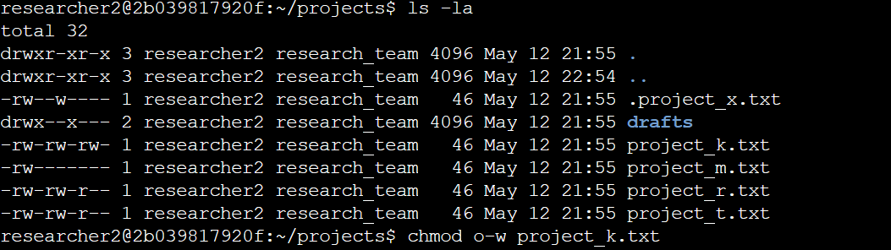
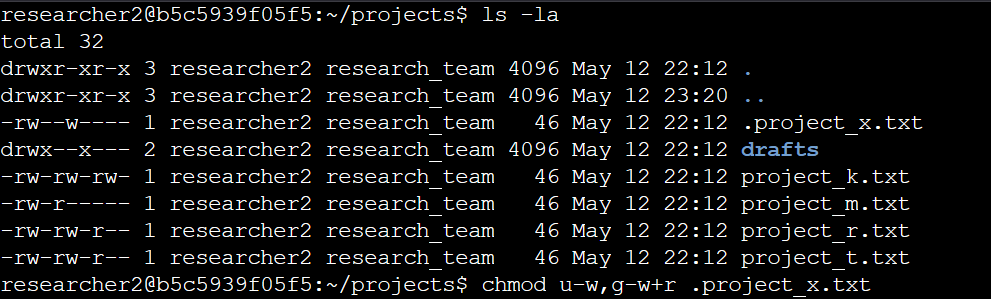
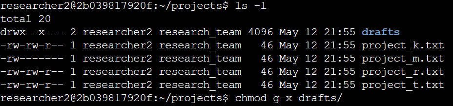

# Linux File Permissions Lab

## Lab Overview

In this lab, I worked inside a Linux environment to investigate and modify file permissions across a research team's directory. The goal was to ensure that only authorized users had the appropriate level of access to files and directories — a core principle in the least privilege model of access control.

This involved reading the current permission settings, identifying misconfigurations, and using the correct commands to bring them in line with what the organization required.

---

## Commands Used

### `ls -la`

The `ls -la` command lists all files and directories in the current location, including hidden files (those starting with a `.`). The `-l` flag displays results in long format, which includes permission strings, ownership, file size, and modification date. The `-a` flag ensures hidden files aren't overlooked.



**Breaking down the permission string** (e.g., `-rw-rw-rw-`):

| Position | Meaning |
|----------|---------|
| 1st character | File type: `-` = file, `d` = directory |
| Characters 2-4 | Owner permissions (read, write, execute) |
| Characters 5-7 | Group permissions (read, write, execute) |
| Characters 8-10 | Other permissions (read, write, execute) |

Each permission slot uses:
- `r` — read
- `w` — write
- `x` — execute
- `-` — permission not granted


### `chmod`

The `chmod` command stands for "change mode" and is used to modify the permissions on a file or directory. It follows this syntax:

```
chmod [who][operator][permission] filename
```

| Symbol | Meaning |
|--------|---------|
| `u` | User (owner) |
| `g` | Group |
| `o` | Other |
| `+` | Add permission |
| `-` | Remove permission |
| `=` | Set exact permissions |

**Examples:**
```bash
chmod o-w project_k.txt       # Remove write access from others
chmod u-w,g-w .project_x.txt  # Remove write from user and group
chmod g-x drafts              # Remove execute from group on a directory
```

---

## 🔬 Lab Walkthrough

### Step 1 — Checking Existing Permissions

Before making any changes, I ran `ls -la` inside the `/home/researcher2/projects` directory to get a full picture of the current permission state, including any hidden files.

### Step 2 — Changing a File Permission

The file `project_k.txt` had write access granted to "other," which was not authorized. No outside user should have the ability to modify this file, so I removed that permission using `chmod`.

```bash
chmod o-w project_k.txt
```



### Step 3 — Changing a Hidden File Permission

The hidden file `.project_x.txt` had write permissions for both the user and the group. Since this file was archived, neither should be able to write to it — but both should still be able to read it. I updated both at once with a single command.

```bash
chmod u-w,g-w+r .project_x.txt
```



### Step 4 — Changing a Directory Permission

The `drafts` directory had execute permissions for the group, which allowed group members to access and traverse it. Only the owner (`researcher2`) should have that access, so I removed it from the group.

```bash
chmod g-x drafts
```



---

## 💡 Key Takeaways

- The `ls -la` command is essential for auditing permissions because it surfaces hidden files that a standard `ls` would skip entirely.
- The `chmod` command gives precise control over who can read, write, or execute a file — and changes take effect immediately.
- Applying the principle of least privilege means routinely checking for and removing permissions that aren't explicitly needed, not just adding the ones that are.

---

## 🔗 Back to Main Portfolio
 
[← Return to Google Cybersecurity Certificate Repository](../../README.md)
