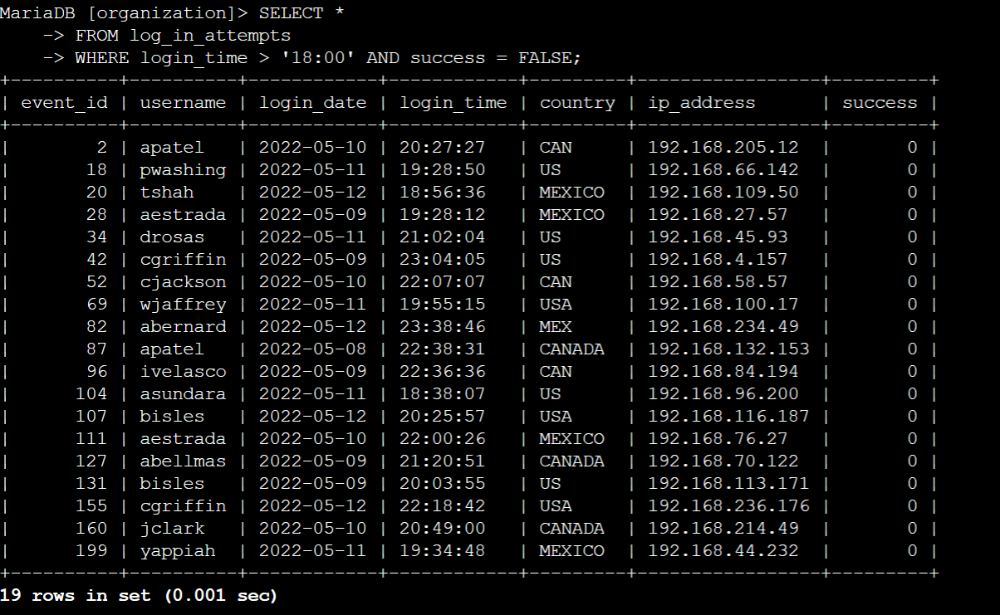
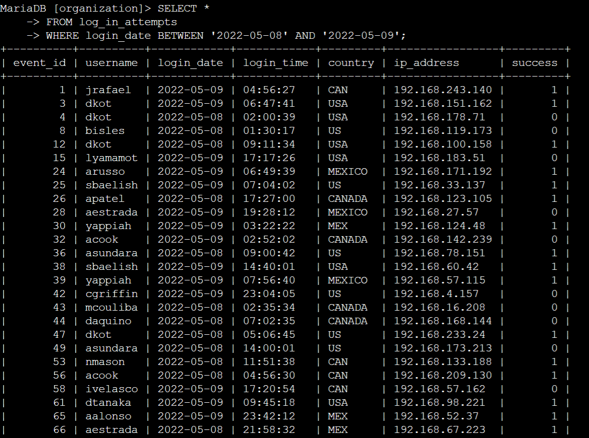
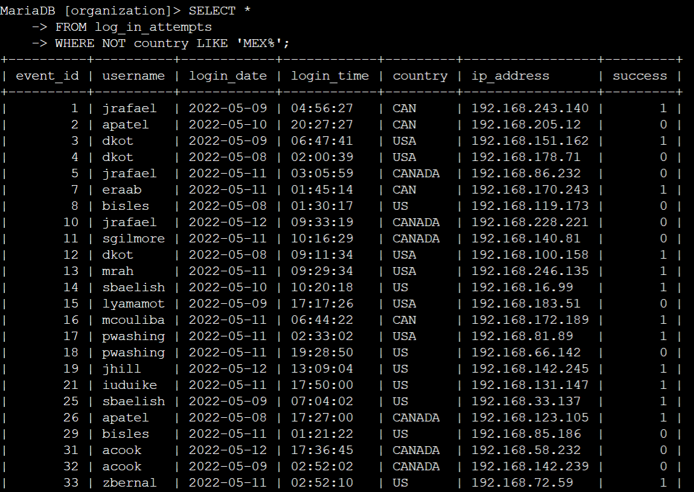
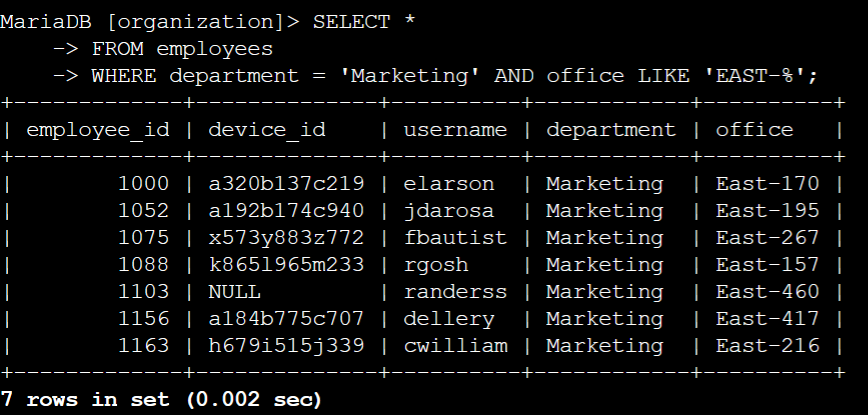
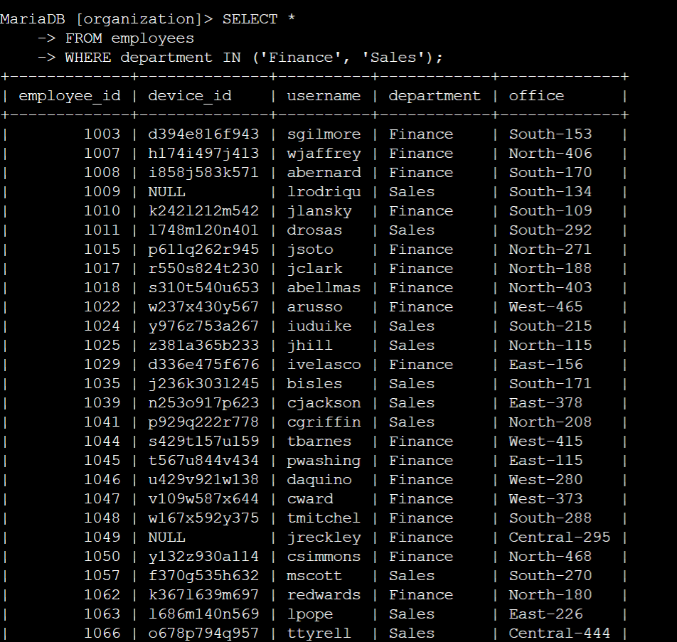
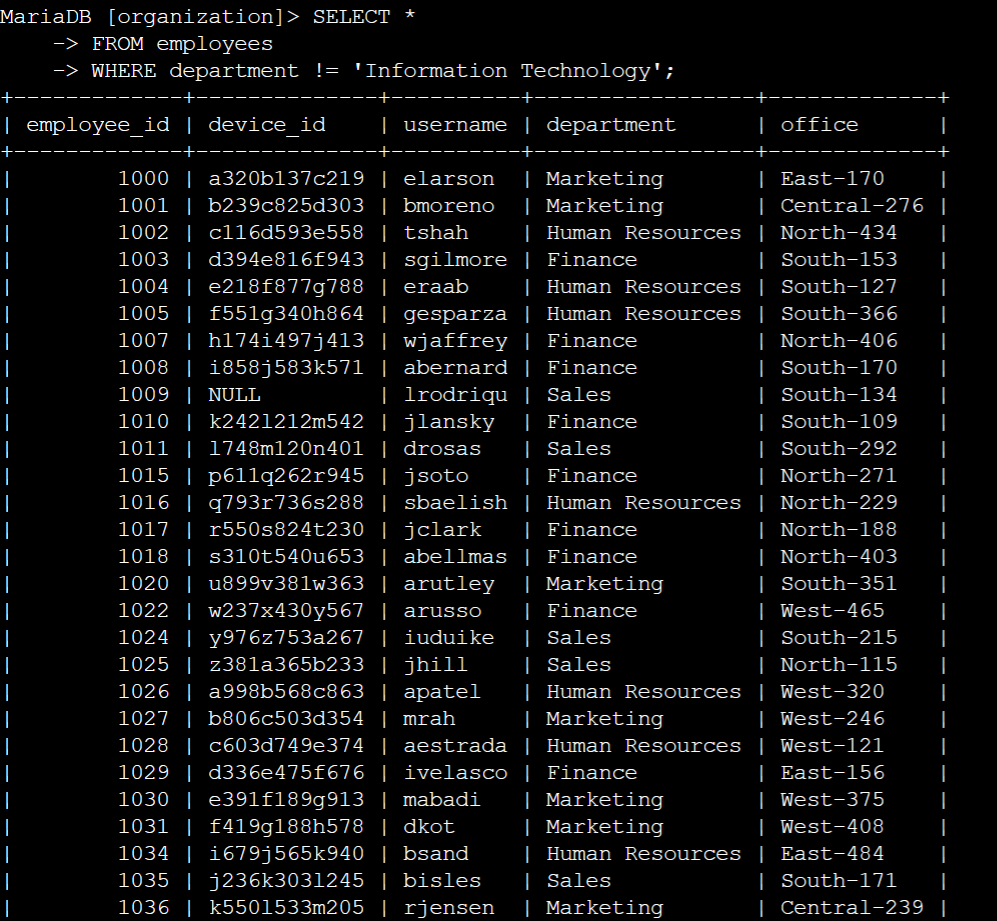

# SQL Filters Lab

## Lab Overview

In this lab, I used SQL queries to investigate login activity and employee records within a simulated organization's database. The goal was to retrieve and filter data in a way that would support a security investigation — identifying suspicious login attempts, narrowing down records by date range, and isolating specific employee groups based on department and location.

This involved writing targeted `SELECT` queries using a variety of filtering techniques including comparison operators, date ranges, pattern matching, and logical operators to pull only the records relevant to each scenario.

---

## Commands Used

### `SELECT` with `WHERE`

The `SELECT` statement retrieves data from a table. Pairing it with a `WHERE` clause allows you to filter results down to only the rows that match a specific condition, which is essential when working with large datasets during a security investigation.

Basic syntax:

```sql
SELECT * FROM table_name WHERE condition;
```

| Operator | Meaning |
|----------|---------|
| `=` | Equal to |
| `!=` | Not equal to |
| `>` / `<` | Greater than / Less than |
| `BETWEEN` | Within a range (inclusive) |
| `LIKE` | Pattern match using wildcards |
| `NOT` | Negates a condition |
| `AND` | Both conditions must be true |
| `IN` | Matches any value in a list |

---

## 🔬 Lab Walkthrough

### Query 1 — After-Hours Login Attempts

The security team needed to investigate login attempts that occurred outside of normal business hours. Any failed login after 6:00 PM was flagged as potentially suspicious. I filtered the `log_in_attempts` table for records where the login time was past 18:00 and the attempt was unsuccessful.

```sql
SELECT *
FROM log_in_attempts
WHERE login_time > '18:00' AND success = FALSE;
```



---

### Query 2 — Login Attempts on Specific Dates

A security incident was reported on May 9, 2022, and the team wanted to review all login activity on that day and the day before to look for any related suspicious behavior. I used `BETWEEN` to capture both dates in a single query.

```sql
SELECT *
FROM log_in_attempts
WHERE login_date BETWEEN '2022-05-08' AND '2022-05-09';
```



---

### Query 3 — Logins Outside of Mexico

The investigation also pointed to activity that may have originated outside of Mexico. I needed to exclude any logins where the country was Mexico — accounting for both `MEX` and `MEXICO` as they appear in the dataset — using `NOT LIKE` with a wildcard.

```sql
SELECT *
FROM log_in_attempts
WHERE NOT country LIKE 'MEX%';
```



---

### Query 4 — Marketing Employees in the East Building

The security team needed to identify all Marketing department employees located in the East office building to push a system update to their machines. Office locations in the dataset include a suffix after the dash (e.g., `EAST-170`), so I used a wildcard to capture all East office variations.

```sql
SELECT *
FROM employees
WHERE department = 'Marketing' AND office LIKE 'EAST-%';
```



---

### Query 5 — Finance and Sales Employees

A separate update needed to be rolled out to all employees in both the Finance and Sales departments. Rather than running two separate queries, I used `IN` to match either department in a single statement.

```sql
SELECT *
FROM employees
WHERE department IN ('Finance', 'Sales');
```



---

### Query 6 — All Employees Outside of IT

The final update was intended for every employee except those in the Information Technology department, who handle their own updates separately. I used `!=` to exclude IT and return everyone else.

```sql
SELECT *
FROM employees
WHERE department != 'Information Technology';
```



---

## 💡 Key Takeaways

- SQL filters let you isolate exactly the data you need from large tables — critical when triaging a security incident where every irrelevant row adds noise.
- Operators like `LIKE`, `BETWEEN`, and `IN` significantly cut down the number of queries needed by handling pattern matching and multi-value conditions in a single statement.
- Combining conditions with `AND`, `NOT`, and `!=` makes it possible to express precise, targeted scenarios — not just "find these records," but "find everything that doesn't fit this profile."

---

## 🔗 Back to Main Portfolio
 
[← Return to Google Cybersecurity Certificate Repository](../../README.md)
